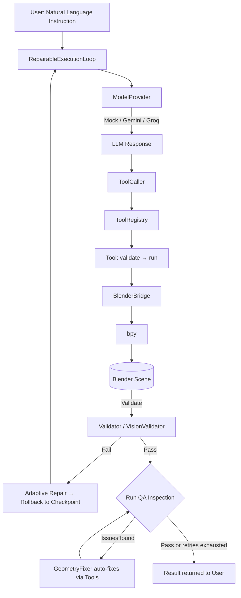
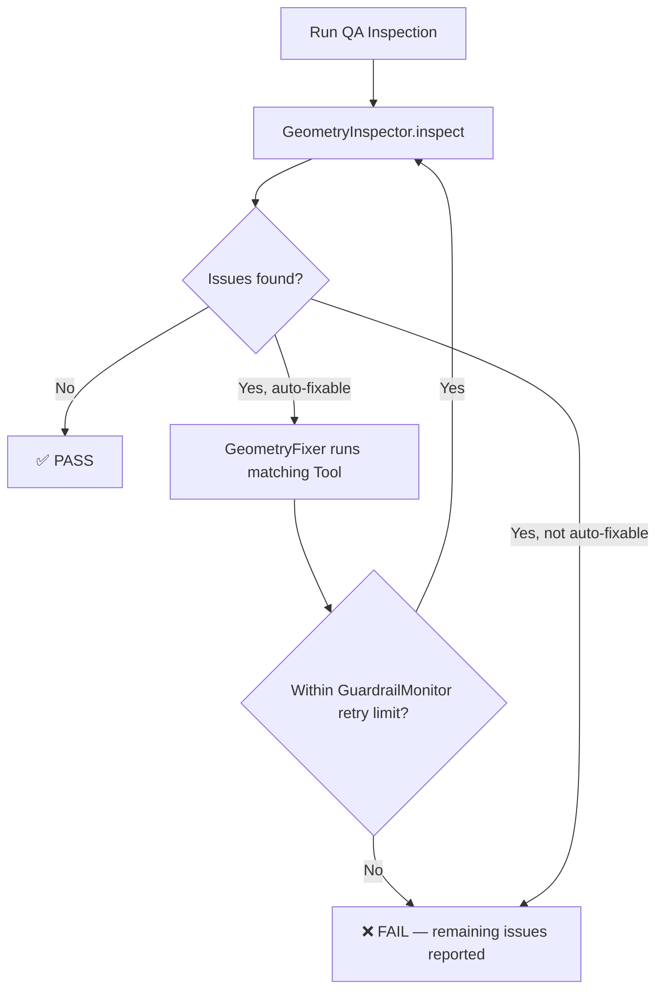

<div align="center">

# 🧠 Blender AI Agent

**A deterministic, strongly-typed, LLM-driven agent framework for controlling Blender using natural language.**

[](https://www.python.org/)
[](https://www.blender.org/)
[](#-testing)
[](#-development-phases)
[](#-license)

*Say "create a cube, move it to x=3, and rename it MainCube" — and watch it happen.*

</div>

---

## 📖 Overview

**Blender AI Agent** lets you control Blender through natural language, backed by an agent architecture that never lets a Large Language Model touch the Blender API directly. Every action the AI takes is routed through a deterministic, permission-gated, independently testable **Tool** layer — the LLM only ever sees tool *names* and *descriptions*, never `bpy`.

The project was built bottom-up, in twelve engineering phases: first a rock-solid deterministic foundation (tools, validation, permissions), then an LLM-agnostic agent core, then reliability (rollback/retry), vision, a Copilot-style chat UX, memory, benchmarking, advanced multi-step orchestration, production tooling, autonomy and multi-agent scaling, and finally an automated asset-quality inspection layer.

> **Engineering philosophy:** Build the deterministic Blender foundation first. Introduce AI only after the execution layer is reliable. Tool response ≠ truth — the Blender scene is the source of truth.

## ✨ Key Features

- 🗣️ **Natural language → Blender actions** — multi-step plans (`object.create → object.transform → object.rename`) executed sequentially and validated against the live scene.
- 🧩 **Strongly-typed Tool system** — every tool follows `validate() → run()` (Template Method pattern), with a `Permission` level (`READ_ONLY` / `SAFE_WRITE` / `DESTRUCTIVE` / `PYTHON_EXECUTION`) and a dataclass-based input contract.
- 🔌 **Pluggable LLM providers** — swap between `MockProvider` (free, deterministic, offline), **Google Gemini**, and **Groq** (free tier, high throughput) without touching the Agent.
- ♻️ **Self-healing execution** — `RepairableExecutionLoop` validates, repairs, retries, and rolls back to the latest checkpoint on failure, instead of crashing or looping forever.
- 👁️ **Vision-aware validation** — the agent can capture the viewport/render and visually confirm that an operation actually worked.
- 💬 **Blender-native Copilot UI** — a sidebar chat panel with progress state, confirmations, and suggestions.
- 🧠 **Typed memory & reusable Skills** — personalized, multi-tool skills instead of one-shot tool calls.
- 📊 **Objective benchmarking** — isolated, partially-scored evaluation of agent performance across tasks.
- 🤖 **Autonomy with guardrails** — `ASSISTED` mode by default, hard limits on steps/retries/runtime, and `PYTHON_EXECUTION` always requires confirmation.
- 🧑‍🤝‍🧑 **Multi-agent orchestration** — a `SupervisorAgent` dispatching domain-specialized agents (modeling, material, camera), benchmarked against single-agent execution rather than assumed superior.
- 🔍 **Automated Asset QA** — a `GeometryInspector` scans mesh objects for non-manifold geometry, flipped normals, and bounding-box overlaps, auto-fixes what it safely can, and re-inspects in a guardrail-limited loop — runnable from Blender's own "Run QA Inspection" button.

## 🏗️ Architecture



**Core architectural rule:** `BlenderBridge` is the *only* place that touches raw `bpy`. Everything above it — tools, agent, validators, QA inspectors — depends on this single abstraction, which is what makes the entire stack (except the two deterministic foundation phases) testable outside Blender using a `FakeBridge`.

| Layer | Responsibility |
|---|---|
| `BlenderBridge` | Sole `bpy` touchpoint; swapped for `FakeBridge` in tests |
| `Tool` (ABC) | `execute()` → `validate()` → `run()`; typed input, `Permission` level |
| `ToolRegistry` / `SkillRegistry` | Name-based lookup so the Agent never needs Python class names |
| `ModelProvider` (ABC) | LLM-agnostic contract — `MockProvider`, `GeminiProvider`, `GroqProvider` |
| `RepairableExecutionLoop` | execute → validate → repair → retry → rollback lifecycle |
| `ConversationState` vs `CopilotSession` | LLM-facing state kept deliberately separate from UI-facing state |
| `AdvancedOrchestrator` | Decomposes complex instructions into a dependency-ordered `TaskGraph` with checkpoint recovery |
| `AutonomyPolicy` / `GuardrailMonitor` | Conservative-by-default autonomy with hard execution limits |
| `Inspector` (ABC) / `InspectionLoop` | inspect → auto-fix → re-inspect scene-quality loop, retry-limited by `GuardrailMonitor` |

## 📂 Project Structure

```
Blender-AI-Agent/
├── run_tests.py                 # Entry point — stubs `bpy` before test discovery
├── tests/                       # Top-level registry tests
└── blender_ai_agent/            # The Blender addon package
    ├── bridge/                  # BlenderBridge — sole bpy touchpoint
    ├── inspectors/               # SceneInspector
    ├── tools/                   # Object / Material / Modifier / Camera / Geometry Nodes / Animation / Python tools
    ├── providers/                # MockProvider, GeminiProvider, GroqProvider, ProviderRegistry
    ├── agent/                   # Agent, Planner, ExecutionLoop, ConversationState
    │   └── advanced/             # TaskDecomposer, TaskGraph, Checkpoints, StrategySelector, SelfEvaluator
    ├── reliability/               # Validators, Snapshot/Rollback, RetryPolicy
    ├── vision/                  # VisionProvider, Capture, VisualSimilarityComparator
    ├── copilot/                  # CopilotController, Session, ProgressState, Confirmations
    ├── memory/                   # Typed Memory, MemoryManager, MemoryRetriever
    ├── skills/                   # Skill abstraction, SkillPermissionChecker
    ├── benchmarks/               # BenchmarkRunner, Evaluator, Reporter, StressTest
    ├── autonomy/                  # AutonomyMode/Policy, GuardrailMonitor
    ├── multi_agent/               # SupervisorAgent, ModelingAgent, MaterialAgent, CameraAgent, CriticAgent
    ├── optimization/              # VisualQualityOptimizer
    ├── orchestration/             # TaskManager (queued → running → paused → ...)
    ├── routing/                   # ModelRouter (fast / strong / vision tiers)
    ├── research/                  # AblationStudy
    ├── config/                    # AgentConfig, ProviderConfig, PermissionConfig
    ├── qa/                        # Inspector (ABC), GeometryInspector, GeometryFixer, InspectionLoop
    ├── sdk/                       # create_tool() — boilerplate-free tool authoring
    ├── ui/                        # Blender sidebar panel (incl. "Run QA Inspection")
    └── tests/                     # 100+ test files covering every phase
```

## 🚀 Getting Started

### Prerequisites

- Blender **3.6+**
- Python **3.10+** (bundled with Blender)
- *(Optional, for real LLM responses)* a [Google Gemini](https://ai.google.dev/) or [Groq](https://console.groq.com/) API key

### Installation

```bash
git clone https://github.com/Dsaini2002/Blender-AI-Agent.git
cd Blender-AI-Agent
```

1. Zip the `blender_ai_agent/` folder.
2. In Blender: `Edit → Preferences → Add-ons → Install...` → select the zip.
3. Enable **Blender AI Agent** in the add-on list.
4. Open the sidebar in the 3D Viewport (`N` key) → **AI Agent** tab.

### Configuring a real LLM provider (optional)

By default the addon runs on `MockProvider` — free, offline, deterministic. To use a real model, set an environment variable **before** launching Blender:

```bash
# Google Gemini
export GEMINI_API_KEY="your-key-here"

# or Groq (free tier, no extra pip install required)
export GROQ_API_KEY="your-key-here"
```

Then pick the provider from the **Provider** dropdown in the sidebar panel (`Mock (Testing)` / `Google Gemini` / `Groq`). Gemini additionally requires:

```bash
pip install google-generativeai
```

API keys are only ever read from environment variables at runtime — never stored or logged.

## 🧪 Testing

```bash
python run_tests.py
```

`run_tests.py` installs a **fake `bpy` module** before test discovery, so the full test suite — **501 tests** — runs on any machine, no Blender installation required.

| Layer | Tested via |
|---|---|
| Blender-touching code (Phases 1–2, QA bridge methods) | Verified end-to-end in real Blender 3.6+ |
| Agent / Reliability / Vision / Copilot / Memory / Skills / Benchmark / Advanced / Autonomy / QA logic | `FakeBridge`, `MockProvider`, `MockVisionProvider` |

### Why the mock layer stays in the repo

`MockProvider` and `FakeBridge` aren't leftover scaffolding — they're load-bearing:

- The entire agent/reliability/vision/copilot/memory/benchmark/autonomy stack is exercised **without** a Blender install, an API key, or any network call.
- Real LLMs are non-deterministic; `MockProvider` returns **scripted, predictable** responses, which is what makes 501 assertions reproducible in CI.
- It mirrors the same pattern used for Blender itself (`BlenderBridge` → `FakeBridge`), keeping the whole codebase testable in isolation.
- It doubles as a **zero-cost, zero-setup demo mode** for anyone trying the addon without an API key.

**Recommendation:** keep the mock provider and fake bridge permanently, alongside — not instead of — real-provider coverage. Treat any new tool or agent behavior as incomplete until it has both a mock-backed unit test and, where relevant, a real-Blender or real-provider smoke test.

## 🗺️ Development Phases

| Phase | Title | Status |
|---|---|---|
| 1 | Blender Foundation — `BlenderBridge`, `SceneInspector`, first tool | ✅ Complete |
| 2 | Tool System — 15+ typed, validated, permissioned tools | ✅ Complete |
| 3 | Agent Core — LLM-agnostic Agent, Planner, multi-step `ExecutionLoop` | ✅ Complete |
| 4 | Reliability — Validation, transactions, rollback, recovery, retry | ✅ Complete |
| 5 | Vision — `VisionProvider`, capture, observation, validation | ✅ Complete |
| 6 | Copilot UX — Blender-native chat UI, progress, confirmations | ✅ Complete |
| 7 | Memory & Skills — Typed memory, reusable multi-tool skills | ✅ Complete |
| 8 | Benchmark — Objective, isolated, scored evaluation | ✅ Complete |
| 9 | Advanced Agents — Task decomposition, checkpoints, Geometry Nodes, animation | ✅ Complete |
| 10 | Production & Community — Configuration, SDK, docs, contribution workflow | ✅ Complete |
| 11 | Scale & Autonomy — Strategy selection, self-evaluation, multi-agent, guardrails | ✅ Complete |
| 12 | Asset QA — Geometry inspection, auto-fix, re-inspection loop, UI-wired | ✅ Complete |

See [`CHANGELOG.md`](blender_ai_agent/.github/docs/CHANGELOG.md) for the full phase-by-phase history.

## 🔍 Asset QA (Phase 12)

Beyond confirming that a tool call *executed*, Phase 12 checks whether its *result* is actually good — the same "generate → inspect → auto-fix → re-inspect → pass/fail" pattern used in production asset pipelines.



| Check | Severity | Auto-fixable | Fix Tool |
|---|---|---|---|
| Non-manifold geometry | HIGH | ❌ (flagged only — needs manual remeshing) | — |
| Flipped normals | MEDIUM | ✅ | `geometry.recalculate_normals` |
| Intersecting objects (bounding-box overlap) | MEDIUM | ✅ | `geometry.separate_overlap` |

- **`Inspector` (ABC)** — same polymorphic pattern as `Tool`/`Validator`; future `UVInspector`, `MaterialInspector`, `AnimationInspector` plug in the same way.
- **`InspectionReport`** — a typed, JSON-serializable result (`passed`, `blocking_issues`, `retries_used`), mirroring `ToolResult`'s "one fixed shape" philosophy.
- **`InspectionLoop`** — reuses Phase 11's `GuardrailMonitor` for the retry limit, so there's no separate/new infinite-loop risk introduced.
- **No new `bpy` touchpoints** — geometry stats (`get_mesh_stats`) and fixes (`recalculate_normals`) live in `BlenderBridge`, and fixes execute through the normal permission-gated `Tool` system, not raw `bpy` calls.
- **Wired into the sidebar** — a **"Run QA Inspection"** button under *Asset QA* in the Copilot panel runs the loop against the live scene and displays a PASS/FAIL report inline.

**Known limitation:** flipped-normal detection is a heuristic (signed mesh volume, reliable mainly for closed meshes) and intersection detection is bounding-box based rather than true mesh-level collision — both are intentional MVP trade-offs, documented here for future refinement.

## 🤝 Contributing

Contributions are welcome! Please read [`CONTRIBUTING.md`](CONTRIBUTING.md) before opening a PR, and see [`docs/tools.md`](blender_ai_agent/.github/docs/tools.md) for a step-by-step guide to authoring a new `Tool`. Bug reports, feature requests, and benchmark issues have dedicated templates under `.github/ISSUE_TEMPLATE/`.

## 🔒 Security

No API key, secret, or credential is ever stored in code, config objects, logs, or `.blend` files — only environment variable *names* are configured; values are read at runtime. See [`SECURITY.md`](blender_ai_agent/SECURITY.md) for the full policy and how to report a vulnerability.

## 📄 License

This project is licensed under the MIT License.

## 👤 Author

**Dinesh Saini** — [@Dsaini2002](https://github.com/Dsaini2002)

---

<div align="center">
<sub>Built phase by phase, with a deterministic foundation first and AI layered on only once it could be trusted.</sub>
</div>
