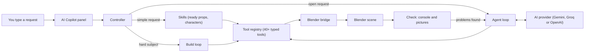
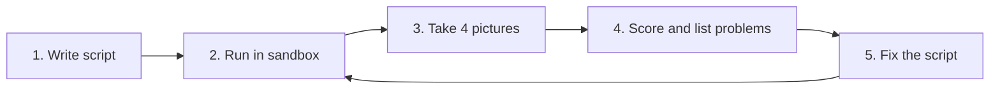

# Blender AI Agent

**Tell Blender what you want. It builds it, checks it, and fixes it.**


Blender AI Agent is an AI helper that lives inside Blender. You type what you want in plain words, like *"make a campfire"* or *"design a modern living room"*. The agent picks the right tools, builds the scene, takes pictures of its own work, and fixes what looks wrong.

It is not a chatbot that pastes random code. It is an **engineered system**: typed tools, a safe sandbox, undo on failure, picture-based checks, and **1,181 automated tests**.

---

## At a glance

| | |
|---|---|
| **Typed tools** | 40+ |
| **Mesh edit presets** | 26 |
| **Built-in props** | 14 |
| **Ready-made materials** | 14 |
| **Free (CC0) models to search** | 991 |
| **Automated tests** | **1,181 passed**, 0 failed, 3 skipped on Windows |
| **In-Blender smoke test** | **56 of 56 checks passed** on Blender 5.2.1 LTS |
| **AI providers** | Gemini, Groq, OpenAI (plus a mock provider for tests) |

---

## See what it can do

| You type | What happens |
|---|---|
| `make a campfire` | A ready-made prop is placed instantly. **No AI request is used.** |
| `make a cute girl with long blonde hair, blue eyes and glasses, laughing` | The cartoon-character skill builds face, hair, clothes and glasses in one call. |
| `make the bottle look melted` | The AI plans two tool calls (a lathed bottle, then a "melted" edit) and runs them. |
| `design a modern living room with a floating ceiling light, a sofa, a bookshelf and a desk` | A big request is split into steps. Each step shows its progress and the time left. |
| `make a realistic sports car` | The **build loop** starts: write a script, take 4 pictures, score them, fix, repeat. |

---

## Why this project is hard

Making an AI control a 3D program is much harder than making it write text. Here are the real problems, and what this project does about each one.

| Problem | Why it is hard | What this project does |
|---|---|---|
| **AI cannot "see" 3D space** | It puts wheels in the air, or a lamp inside a wall. The code runs with no error, but the result is wrong. | Takes pictures from 4 sides, asks a vision model for a score and a list of problems, and runs a physical overlap check on bounding boxes. |
| **AI-written code is risky** | A script can delete your scene or touch your files. | Build scripts run in a sandbox. Only the agent's own tools can be called. Loops and time are limited. A script can delete only the objects it created. |
| **AI sends wrong arguments** | Missing fields, wrong types, wrong units. | Every tool has a typed schema. Inputs are cleaned and checked before anything runs. If a task fails, it is rolled back. |
| **Blender changes between versions** | Socket names and settings are renamed or deprecated. | Material node graphs are checked before use, and errors name the sockets that really exist. Deprecated settings are avoided. |
| **Free AI plans have small limits** | A rate limit in the middle of a build leaves a half-made scene. | Quota errors become short, clear messages. The agent can fall back to a lighter model, and it keeps the best result so far. |
| **Bad meshes break clean-up tools** | Quad remeshing fails on meshes with duplicate points. | SDF meshes are welded and cleaned first. In a real Blender test, a 500-face remesh gave 93.6% quad faces. |
| **Scenes look flat** | Weak models make plain colours and no light. | Built-in quality rules: layers of detail, real materials, a real light for every glowing part, and a finishing pass. |
| **Blender must not freeze** | AI calls take seconds. | AI calls run in the background. A panel shows the step, the progress and the time left. |
| **Platforms behave differently** | Console capture works one way on Linux and another on Windows. | A Windows-safe capture path. |
| **Hard to test without Blender** | Most 3D code needs a running Blender. | A fake Blender bridge and a mock AI provider, so the full test suite runs without Blender. |

---

## How it works


```mermaid
flowchart LR
    U["You type a request"] --> P["AI Copilot panel"]
    P --> C["Controller"]
    C -->|"simple request"| S["Skills (ready props, characters)"]
    C -->|"open request"| A["Agent loop"]
    C -->|"hard subject"| BL["Build loop"]
    A <--> M["AI provider (Gemini, Groq or OpenAI)"]
    S --> R["Tool registry (40+ typed tools)"]
    A --> R
    BL --> R
    R --> B["Blender bridge"]
    B --> E["Blender scene"]
    E --> V["Check: console and pictures"]
    V -->|"problems found"| A
```

**Three ways a request can run**

1. **Skill fast path.** Simple, known requests (a campfire, a cartoon character) are built right away with no AI call. They are fast, free and the same every time.
2. **Planned tool calls.** For open requests, the AI model plans a few tool calls. Each call is checked, run, and logged.
3. **Build loop.** For things no ready tool can make, the agent works like a careful artist:


```mermaid
flowchart LR
    W["1. Write script"] --> X["2. Run in sandbox"] --> Q["3. Take 4 pictures"] --> Y["4. Score and list problems"] --> Z["5. Fix the script"]
    Z --> X
```

The loop stops when the score is good, when the rounds run out, or when a fix makes things worse. The best version is kept.

After **every** task, the agent also reads the Blender console and checks a picture. If it finds a problem, it tries to fix it (up to two more tries).

---

## Features

- **40+ typed tools**: objects, materials, modifiers, cameras, lights, curves, meshes, retopology, assets, and rendering.
- **Mesh toolkit**: lathe, SDF blends, prisms, terrain, formula meshes, and **26 edit presets** (melted, twisted, bent, crushed, spiky, shattered and more).
- **Materials**: **14 ready-made procedural materials** (fire, smoke, wood, rough stone, glass, car paint and more) and custom node graphs with socket checks.
- **Props and models**: **14 built-in props** and a search over **991 free (CC0) models**.
- **Cartoon characters**: faces with 8 expressions, 7 hair styles, clothes, shoes, glasses, caps and hats.
- **Render setup**: AgX colour, depth of field, exposure and presets (cinematic, product, outdoor, night, clean).
- **Self-checking**: build loop, console watch and picture review.
- **Progress panel** with the current step and an estimate of the time left.
- **Three AI providers** (Gemini, Groq, OpenAI) and a **mock provider** for tests.

---

## Quick start (Windows)

You need **Blender 5.2 LTS**, **Git**, and **one API key**. A free Gemini key is enough to start.

**1. Get the code**

```powershell
git clone https://github.com/Dsaini2002/Blender-AI-Agent.git
```

**2. Copy the add-on into Blender**

```powershell
Copy-Item .\Blender-AI-Agent\blender_ai_agent "$env:APPDATA\Blender Foundation\Blender\5.2\scripts\addons\" -Recurse
```

**3. Add your key, then restart Blender**

```powershell
setx GEMINI_API_KEY "paste-your-key-here"
```

**4. Turn it on.** In Blender: *Edit > Preferences > Add-ons*, enable `blender_ai_agent`. Press **N** in the 3D viewport and open the **AI Copilot** tab.

**5. Ask for something**

```
make a campfire, add a tent, add a lantern
```

### Settings

| Environment variable | What it does |
|---|---|
| `GEMINI_API_KEY` | Key for Google Gemini. |
| `GROQ_API_KEY` | Key for Groq. |
| `OPENAI_API_KEY` | Key for OpenAI. |
| `BLENDER_AI_AUTOVERIFY` | Set to `console` to keep the automatic console check but skip the picture check (saves AI quota). |
| `BLENDER_AI_MODELS_DIR` | Folder that holds your downloaded CC0 models. |

---

## Safety and reliability

- **Sandbox**: build scripts can only call the agent's own tools. No imports. No file access. Limits on loops and time.
- **Scoped deletes**: a script may delete only objects it made itself.
- **Rollback**: failed or cancelled work is undone.
- **Python tool asks first**: the raw `python.execute` tool always needs your approval.
- **Keys stay private**: API keys are read from environment variables and are never shown.
- **Quota-safe**: rate-limit errors stop the run cleanly and keep the best result.

---

## Testing

Good tests are what make an AI-driven system safe to change. Every part of this project has tests, and they run **without Blender**.

### Tests at a glance

| Check | Result |
|---|---|
| Automated tests (`python run_tests.py`) | **1,181 passed**, 0 failed |
| Skipped tests | 3 (Windows only, see below) |
| Needs Blender to run? | **No.** A fake Blender bridge and a mock AI provider stand in for them. |
| In-Blender smoke test (`blender_smoke_test.py`) | **56 of 56 checks passed** (0 failed, 0 warnings) on Blender 5.2.1 LTS |

### What the tests cover

- **Tool inputs**: wrong types, missing fields and loose wording are cleaned or rejected before anything runs.
- **Mesh tools**: lathe, SDF blends, prisms, terrain, formula meshes, the 26 edit presets, and damage.
- **Materials**: the 14 recipes and custom node graphs, including socket checks and clear error messages.
- **Build-script sandbox**: blocked imports, no file access, limits on loops and time, and "only the agent's own tools".
- **Self-correcting build loop**: the overlap check, car clearance rules, round limits, and stopping when a fix makes things worse.
- **Automatic check**: reading the Blender console and the picture review.
- **Request handling**: splitting a big request into steps, progress and time-left estimates, and rollback after a failure.
- **Skills**: ready props, cartoon characters (faces, hair, clothes, glasses) and the campsite layout.
- **Assets**: the built-in prop catalogue and the search over local CC0 models.
- **Lights, cameras and render setup**: presets and safe limits.
- **Friendly errors**: for example a rate-limit message that tells you what to do next.

### The 3 skipped tests

They test low-level (file-descriptor) console capture. That works on Linux and macOS, but it is switched off on Windows, where the agent reads Python-level messages instead.

### Run them

```powershell
python run_tests.py
```

The last lines show the result, for example `Ran 1181 tests ... OK (skipped=3)`.
To run one file, from the project root:

```powershell
python -m unittest blender_ai_agent.tests.test_shader_nodes -v
```

### Smoke test inside Blender

Open Blender's *Scripting* tab, load `blender_smoke_test.py` and run it. It uses the real tools on a real scene and prints one line per check.

### Real-Blender checks

These were also checked by hand in Blender 5.2.1 LTS: a campfire with stones, logs and curved flames; a remesh of 500 faces that gave 93.6% quad faces; a melted bottle with smooth shading; and a cartoon character in a campfire scene.

### The rule

A change is merged only when `python run_tests.py` passes.

---

## Project layout

```
blender_ai_agent/
├── agent/        # planning loop, prompts, build-script sandbox, self-correct loop, post-run checks
├── bridge/       # BlenderBridge: the only layer that changes the Blender scene
├── copilot/      # controller, task splitter, progress and ETA
├── tools/        # typed tools (objects, meshes, materials, cameras, lights, assets...)
├── skills/       # fast paths: ready props, characters, iterative build
├── inspectors/   # reads and describes the current scene
├── reliability/  # friendly errors and repair helpers
├── library/      # built-in prop catalogue
├── vision/       # picture review tool
├── ui/           # Blender panels
└── tests/        # unit and integration tests
```

---

## Design choices

- **Typed tools, not free code.** Small tools with schemas are easier to check, test, undo and explain than long scripts.
- **Known work skips the AI.** If a task has a ready skill, it is faster, cheaper and the same every time.
- **One bridge to Blender.** Only `BlenderBridge` changes the scene. This keeps the rest of the code testable without Blender.
- **Pictures are part of the loop.** Code that runs without error can still make a wrong scene. The agent checks what it made.
- **Fail safely.** Every run can be undone, and quota or network problems end with a clear message.

---

## Good to know

- Hard subjects, like a car, are built from simple shapes and ready-made materials. Expect clean results that are easy to recognise, not photographs.
- A free Gemini key has a small daily limit. Use `BLENDER_AI_AUTOVERIFY=console` to save requests.
- On Windows, the console check reads Python messages, but not low-level Blender warnings.
- The procedural materials are made for Blender 5.2 LTS.

---

## Contributing

Ideas, bug reports and pull requests are welcome.

1. Fork the repo and create a branch.
2. Make your change, and add a test for it.
3. Run `python run_tests.py` and make sure all tests pass (it should end with `OK`).
4. Open a pull request and explain *what* changed and *why*.

---

## Author

Made by **Dinesh Saini**, a student at **NIT Trichy**.
GitHub: [@Dsaini2002](https://github.com/Dsaini2002)

---

## License

GPL-3.0-or-later. See the `LICENSE` file.
